# Innova-2 XCKU15P FPGA DDR4 Troubleshooting

The Innova-2 Flex [MNV303212A-AD**L**T](https://docs.nvidia.com/networking/display/Innova2Flex/Specifications) has five [MT40A1G16](https://www.micron.com/products/dram/ddr4-sdram/part-catalog/mt40a1g16knr-075) DDR4 ICs with **D9WFR** [FBGA Code](https://www.micron.com/support/tools-and-utilities/fbga?fbga=D9WFR#pnlFBGA) on the board for **8GB** of DDR4.

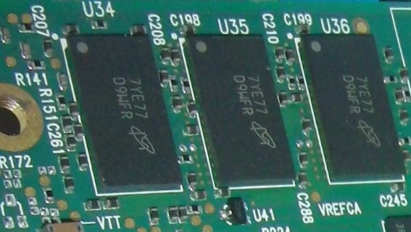

I have seen a MNV303212A-AD**I**T in the wild which has **MT40A512M16** DDR4 ICs with **D9TBK** [FBGA Code](https://www.micron.com/support/tools-and-utilities/fbga?fbga=D9TBK#pnlFBGA). The rest of the board looks the same so it would have **4GB** of DDR4. Unfortunately none of the designs in my repositories would work with this board. All designs would need to be recompiled for the *MT40A512M16JY-083E:B*. I do not have access to such a board for testing.

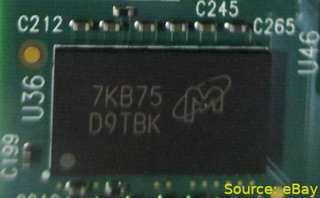

## DDR4 Communication Error

If you attempt to send data to the DDR4 address but get `write file: Unknown error 512` it likely means DDR4 did not initialize properly. Start by performing a cold reboot and checking communication again. The [innova2_xcku15p_ddr4_bram_gpio](https://github.com/mwrnd/innova2_xcku15p_ddr4_bram_gpio) project and all troubleshooting bitstreams have DDR4 at address `0x0` but if you made any changes to the design confirm in the *Vivado* **Block Design** *Address Editor* that it is still `0`.

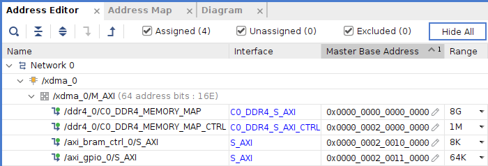

If [BRAM and GPIO communication](https://github.com/mwrnd/innova2_xcku15p_ddr4_bram_gpio#axi-bram-communication) succeed but DDR4 fails then the issue is with DDR4.
```Shell
cd ~/dma_ip_drivers/XDMA/linux-kernel/tools/
dd if=/dev/urandom bs=1 count=8192 of=TEST
sudo ./dma_to_device   --verbose --device /dev/xdma0_h2c_0 --address 0x0 --size 8192  -f    TEST
```

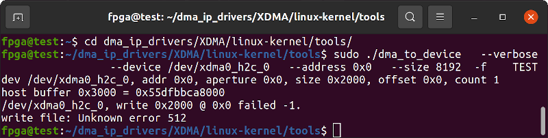

A copy of [Xilinx's PG150 Memory IP Guide](https://www.xilinx.com/support/documentation/ip_documentation/ultrascale_memory_ip/v1_4/pg150-ultrascale-memory-ip.pdf) is useful to have.

### Load the ddr4_0_ex Bitstream and Connect JTAG

[ddr4_0_ex](#recreating-ddr4_0_ex-example-design) is Xilinx's Example Design for DDR4. It includes an Integrated Logic Analyzer (ILA) and access to calibration details.

Refer to the `innova2_flex_xcku15p_notes` project's instructions on [Loading a User Image](https://github.com/mwrnd/innova2_flex_xcku15p_notes/#loading-a-user-image) and load the [included](ddr4_0_ex) `innova2_ddr4_0_ex` bitstream onto the Innova-2's Configuration Memory.

```Shell
cd ddr4_0_ex
md5sum *bin
echo 17875fbea8e5e3426092b44884dbf717 should be md5sum of innova2_ddr4_0_ex_primary.bin
echo e182409813ddd130f50b2faa3257a5bb should be md5sum of innova2_ddr4_0_ex_secondary.bin
```

Connect your [Xilinx-Compatible](https://docs.xilinx.com/v/u/en-US/ds593) **1.8V** [JTAG Adapter](https://www.waveshare.com/platform-cable-usb.htm) to view DDR4 calibration status.

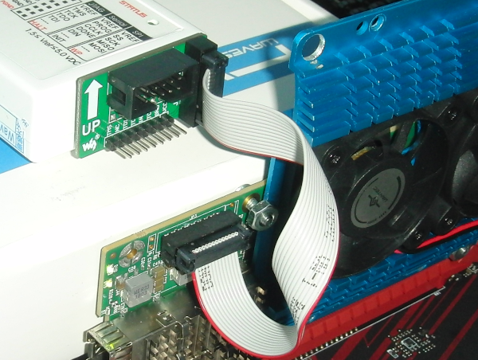

Start *Vivado* or *Vivado Lab Edition* Hardware Manager.

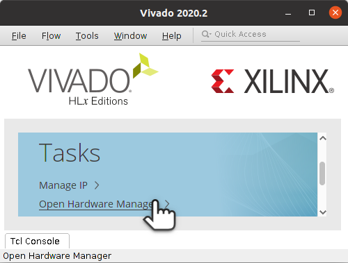

Open Target and Auto Connect.

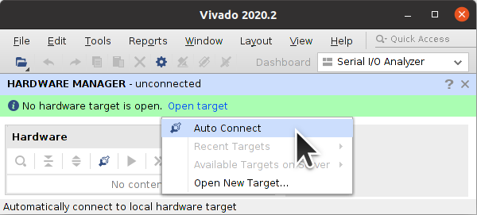

Click on *MIG_1* to view DDR4 calibration status. I do not know if the *ddr4_0_ex* design continues testing past the first fault. Byte Lane 1 is shown to have a fault.

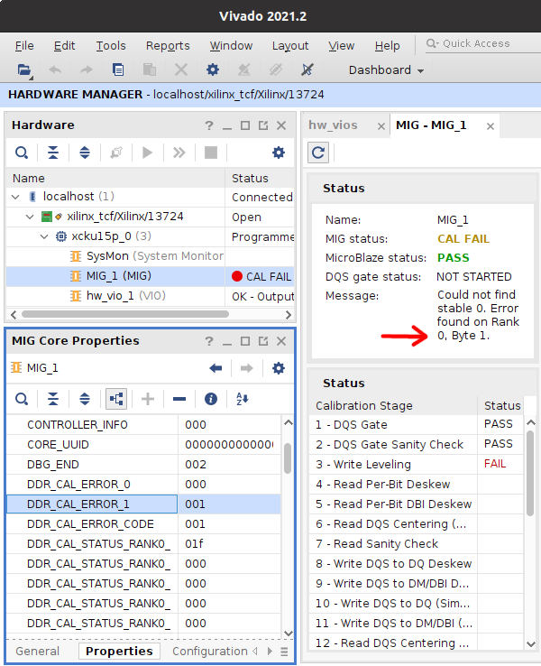

I encountered a *Write Leveling* failure.

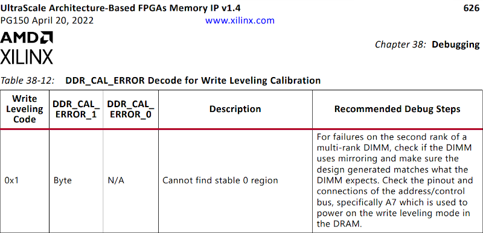

If calibration finishes successfully you will see something like the following:

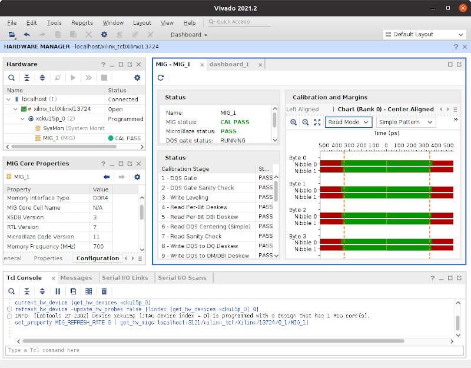

For other types of failures, continue by enabling the ILA and explore [Xilinx's DDR4 Issues Page](https://support.xilinx.com/s/article/69035?language=en_US) and the [Xilinx DDR4 Design Hub](https://www.xilinx.com/support/documentation-navigation/design-hubs/dh0061-ultrascale-memory-interface-ddr4-ddr3-hub.html).

Click on *Specify Debug Probes* in the *Trigger Setup* window.

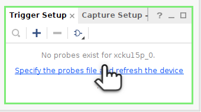

Select the included [debug_nets.ltx](ddr4_0_ex/debug_nets.ltx).

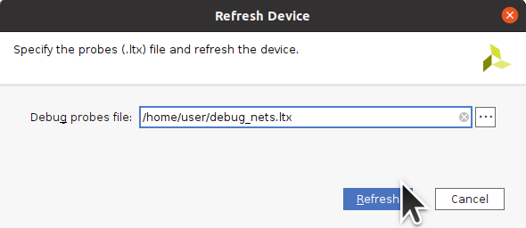

Select the *Run Trigger* button to re-start the DDR4 calibration sequence and capture critical signal waveforms.

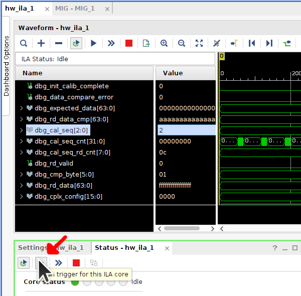


### CAL FAIL Write Leveling

Write Leveling calibrates clock to Data Strobe (DQS) signal timings. DDR4 uses a fly-by wiring topology for control and address signals but point-to-point for Data Strobe (DQS), Data Mask (DM), and Data Byte Lanes (DQ). It is worthwhile to test individual byte lanes on a Write Leveling error as it is unlikely every memory IC is broken. Some of the memory address space may still be usable.

There are five [MT40A1G16KNR-075 ICs](https://www.micron.com/products/dram/ddr4-sdram/part-catalog/mt40a1g16knr-075) with **D9WFR** [FBGA Code](https://www.micron.com/support/tools-and-utilities/fbga?fbga=D9WFR#pnlFBGA) on the board which each have two x8 dies. The full memory interface is 72-Bit (64-Bit + ECC) so only 9 of the 10 dies are used.

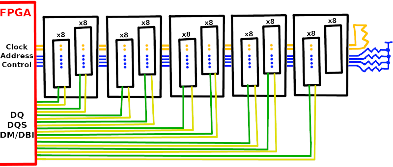

The Xilinx DDR4 IP only allows 8, 16, 32, 64, and 72 bit (64-bit with ECC) wide DDR4 interfaces. Therefore you can have 1GB, 2GB, 4GB, 8GB, or 8GB with ECC of memory space. Bank 66 is the main Address/Control/Byte-Lane-0 bank while Bank 67 is for Byte Lanes 3, 4, 5, and 6. Bank 68 is for Byte Lanes 1, 2, 7, and 8.

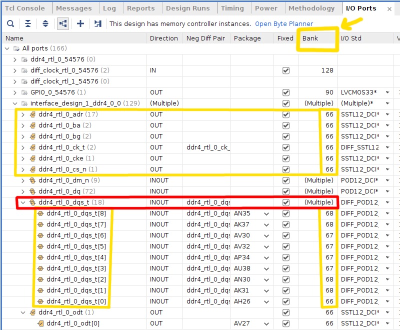

I first tested a slower version of the DDR4 memory interface, DDR4-1400 which runs at 700MHz. I also got a Write Leveling Calibration error.

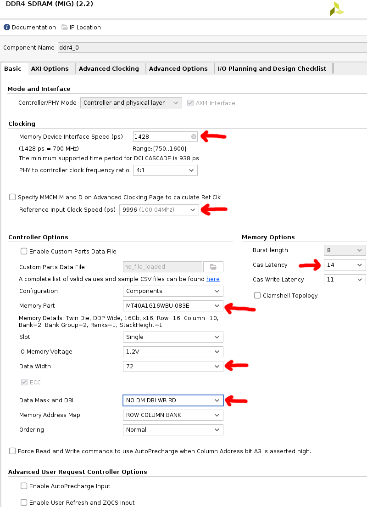

I also connected *ddr4_ui_clk* to the divide-by-2^27 counter to blink the D18 LED if the DDR4 block is active.

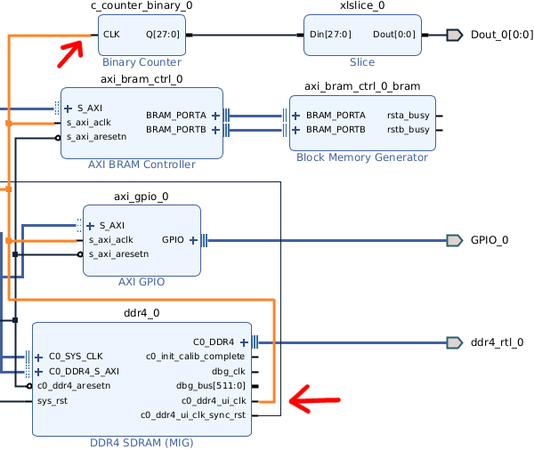


#### Test the Various Byte Lane Combinations

In the [bitstreams](bitstreams) directory are bitstreams with different combinations of interface width and byte lanes used. They are zipped to reduce download size. The associated [project tcl and constraint files](project_tcl) can be `source`ed in *Vivado* [to re-create the associated designs](https://github.com/mwrnd/innova2_xcku15p_ddr4_bram_gpio#recreating-the-design-in-vivado).

Refer to the `innova2_flex_xcku15p_notes` project's instructions on [Loading a User Image](https://github.com/mwrnd/innova2_flex_xcku15p_notes/#loading-a-user-image) to load and then test each bitstream.

For example, a bitstream containing a modified [innova2_xcku15p_ddr4_bram_gpio](https://github.com/mwrnd/innova2_xcku15p_ddr4_bram_gpio) project with 1GB 8-bit wide DDR4 using only byte lane 0 is in [innova2_ddr4_8bit_byte-lane-0_bitstream.zip](bitstreams/innova2_ddr4_8bit_byte-lane-0_bitstream.zip).
```Shell
unzip innova2_ddr4_8bit_byte-lane-0_bitstream.zip ; md5sum *bin
echo 97b4adfa0435bbc22c436da3c2168123 should be md5sum of innova2_ddr4_8bit_byte-lane-0_primary.bin
echo 3cff1eff537d89a4361b2cce325feecf should be md5sum of innova2_ddr4_8bit_byte-lane-0_secondary.bin
```

After loading the bitstream as the Innova-2's User Image and rebooting, run the following commands to test the XDMA-to-BRAM PCIe connection, blink the LED, and then copy some data to and from DDR4 ICs.
```Shell
cd ~/dma_ip_drivers/XDMA/linux-kernel/tools/
dd if=/dev/urandom bs=8192 count=1 of=TEST
echo -n -e "\xff" >ff.bin  ;  echo -n -e "\x00" >00.bin
sudo ./dma_to_device   --verbose --device /dev/xdma0_h2c_0 --address 0x200100000 --size 8192 -f     TEST
sudo ./dma_from_device --verbose --device /dev/xdma0_c2h_0 --address 0x200100000 --size 8192 --file RECV
sudo ./dma_to_device   --verbose --device /dev/xdma0_h2c_0 --address 0x200110000 --size 1    -f     ff.bin
sleep 1
sudo ./dma_to_device   --verbose --device /dev/xdma0_h2c_0 --address 0x200110000 --size 1    -f     00.bin
sudo ./dma_to_device   --verbose --device /dev/xdma0_h2c_0 --address 0x0         --size 8192 -f     TEST
sudo ./dma_from_device --verbose --device /dev/xdma0_c2h_0 --address 0x0         --size 8192 --file RECV
md5sum TEST RECV
```

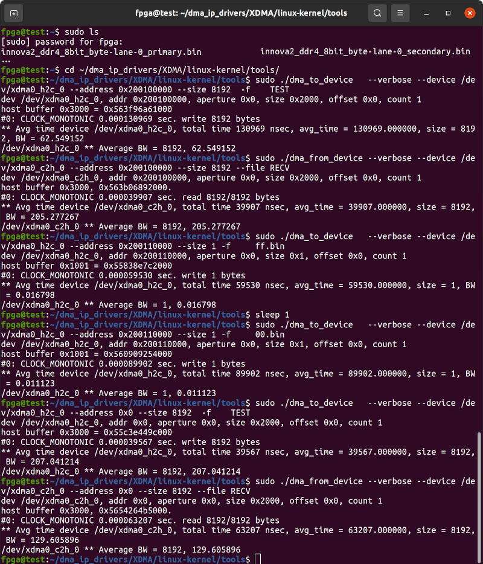

Afterwards, enable the Innova-2 Flex Image, reboot, and load the next bitstream.
```Shell
sudo mst start
cd ~/Innova_2_Flex_Open_18_12/driver/
sudo ./make_device
cd ~
sudo insmod /usr/lib/modules/5.8.0-43-generic/updates/dkms/mlx5_fpga_tools.ko
sudo ~/Innova_2_Flex_Open_18_12/app/innova2_flex_app -v
```

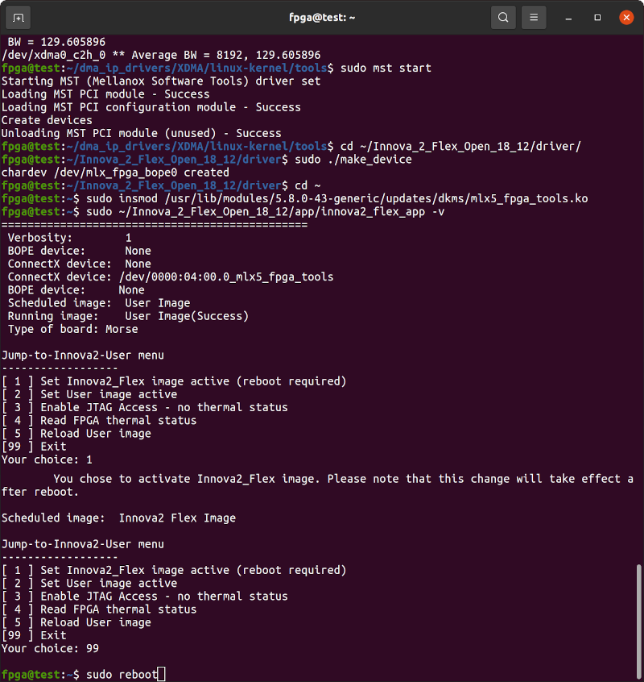

The process of loading a bitstream, rebooting, testing, enabling the Flex Image, rebooting, loading a bitstream, etc. takes about 10 minutes. Expect to spend about 2 hours testing every byte lane combination bitstream.

Continue testing the single byte-lane 8bit-wide DDR4 designs with 1GB of memory capacity.

```Shell
unzip innova2_ddr4_8bit_byte-lane-3_bitstream.zip ; md5sum *bin
echo bb745d726307d82bcc928b0ade1b16e0 should be md5sum of innova2_ddr4_8bit_byte-lane-3_primary.bin
echo dadb8a9e26060786b1190254dc48a6cf should be md5sum of innova2_ddr4_8bit_byte-lane-3_secondary.bin

unzip innova2_ddr4_8bit_byte-lane-4_bitstream.zip ; md5sum *bin
echo 0d0e3e6d4d93fa045b42b90f063a1c80 should be md5sum of innova2_ddr4_8bit_byte-lane-4_primary.bin
echo a4dcaee800436b29aba1be783241ca08 should be md5sum of innova2_ddr4_8bit_byte-lane-4_secondary.bin

unzip innova2_ddr4_8bit_byte-lane-5_bitstream.zip ; md5sum *bin
echo 2944b78f8599f993e678074c646a1749 should be md5sum of innova2_ddr4_8bit_byte-lane-5_primary.bin
echo c7584081ec9f56e9b2b7484862ddb4f0 should be md5sum of innova2_ddr4_8bit_byte-lane-5_secondary.bin

unzip innova2_ddr4_8bit_byte-lane-6_bitstream.zip ; md5sum *bin
echo 760c27b828931cadabc7dd4af73bb291 should be md5sum of innova2_ddr4_8bit_byte-lane-6_primary.bin
echo d80db60d583ea83db4101dfdb6890832 should be md5sum of innova2_ddr4_8bit_byte-lane-6_secondary.bin
```

The 16bit-wide 2GB versions of the DDR4 interface must use Byte Lanes from Bank 67 and Bank 68. Banks used must be contiguous. You cannot skip Bank 67 and use Banks 66 and 68. To cut down on the number of byte-lane combinations I use Byte Lane 3 from Bank 67 to test Bank 68 lanes.

If your board fails the 8bit Byte-Lane-3 bitstream above then choose a different, working byte lane from Bank66 and create new bitstreams by `source`ing one of the `ddr4_8bit` [.tcl](project_tcl) files in *Vivado* and editing the constraints `.xdc` file appropriately.

```Shell
unzip innova2_ddr4_16bit_byte-lanes-1-3_bitstream.zip ; md5sum *bin
echo 2c5826523ced56401e599399b33aa4d9 should be md5sum of innova2_ddr4_16bit_byte-lanes-1-3_primary.bin
echo 4013a26b3ae4432d74f563dc2482f30b should be md5sum of innova2_ddr4_16bit_byte-lanes-1-3_secondary.bin

unzip innova2_ddr4_16bit_byte-lanes-2-3_bitstream.zip ; md5sum *bin
echo 4dbd91cc54dce835fb53134bffc2cca8 should be md5sum of innova2_ddr4_16bit_byte-lanes-2-3_primary.bin
echo 2fd1261ffcc5d8697909a8ef5b3db761 should be md5sum of innova2_ddr4_16bit_byte-lanes-2-3_secondary.bin

unzip innova2_ddr4_16bit_byte-lanes-3-7_bitstream.zip ; md5sum *bin
echo 6204e6b9a152d87f6b1ab4d826e1516e should be md5sum of innova2_ddr4_16bit_byte-lanes-3-7_primary.bin
echo 3f16c6b3a9cbfbe5038e53def58e1e42 should be md5sum of innova2_ddr4_16bit_byte-lanes-3-7_secondary.bin

unzip innova2_ddr4_16bit_byte-lanes-3-8_bitstream.zip ; md5sum *bin
echo 9d12941d3b66fe64c412bd63c21ef16e should be md5sum of innova2_ddr4_16bit_byte-lanes-3-8_primary.bin
echo 1a74429703a96461a890f0895cb8f534 should be md5sum of innova2_ddr4_16bit_byte-lanes-3-8_secondary.bin

unzip innova2_ddr4_16bit_byte-lanes-6-7_bitstream.zip ; md5sum *bin
echo 666fd64f422aee0cf71c2ef003aedd22 should be md5sum of innova2_ddr4_16bit_byte-lanes-6-7_primary.bin
echo 69d28b333656ee62f691166dfac61f74 should be md5sum of innova2_ddr4_16bit_byte-lanes-6-7_secondary.bin
```

If the 4 byte lanes from Bank67 work in an 8bit design, they should also work in a 32bit-wide design with 4GB of memory capacity.
```Shell
unzip innova2_ddr4_32bit_byte-lanes-3-4-5-6_bitstream.zip ; md5sum *bin
echo 080f14e16954eaec71cbd4a6727e980d should be md5sum of innova2_ddr4_32bit_byte-lanes-3-4-5-6_primary.bin
echo ca572811d469105a1b53a8deb406c59a should be md5sum of innova2_ddr4_32bit_byte-lanes-3-4-5-6_secondary.bin
```

I have a board which worked with all but the `byte-lanes-1-3` design. It has a broken Byte Lane 1.

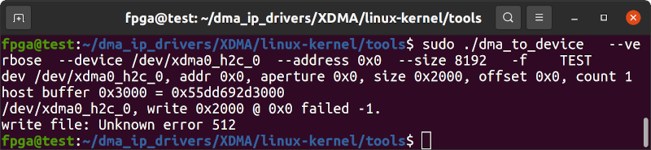

I then tested 64-Bit versions of the DDR4 memory interface without Byte Lane 1 at two speeds, DDR4-1400 (**1428**ps) and DDR4-2400 (**833**ps). Both worked! Since I do not have access to a schematic I cannot further investigate my Byte Lane issue. However, I do not need ECC so having the full 8GB of working RAM is good enough.

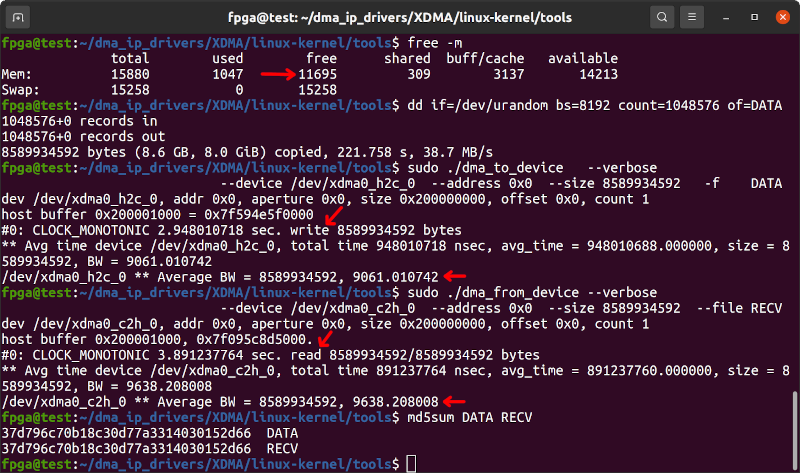


## Recreating ddr4_0_ex Example Design

The included [ddr4_0_ex_example_design.xdc](ddr4_0_ex/ddr4_0_ex_example_design.xdc) constraints file has the correct pin mappings when creating the DDR4 Example Design using **Vivado 2021.2**.

Begin by `source`ing the [innova2_xcku15p_ddr4_bram_gpio](https://github.com/mwrnd/innova2_xcku15p_ddr4_bram_gpio#recreating-the-design-in-vivado) project. Open the Block Design and edit the DDR4 options to slower memory speeds (**1428**ps) and the built-in IC configuration (**MT40A1G16WBU-083E**). Set *CAS Latency* to the highest value.


Select the option to enable Debug Signals under Advanced Options in the DDR4 IP Customizer and click Accept to finish.

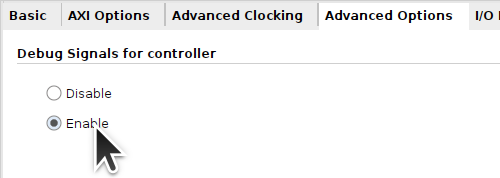

Right-click on the DDR4 Block and choose *Open IP Example Design*.

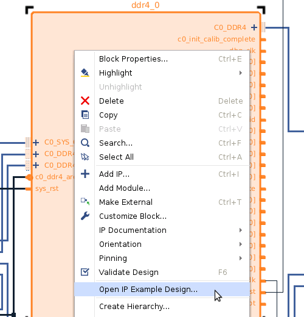

After Vivado generates the Example Design, confirm the *Integrated Logic Analyzer (ILA)* is present in the design. If not, confirm *Debug Signals* were enabled and saved and try again.

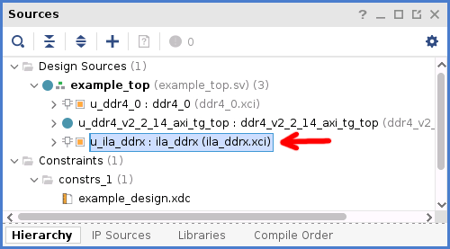

The `sys_rst` signal must be inverted in *example_top.sv*. Also, update the Constraints File *example_design.xdc* with the contents of the included [ddr4_0_ex_example_design.xdc](ddr4_0_ex_example_design.xdc) file.

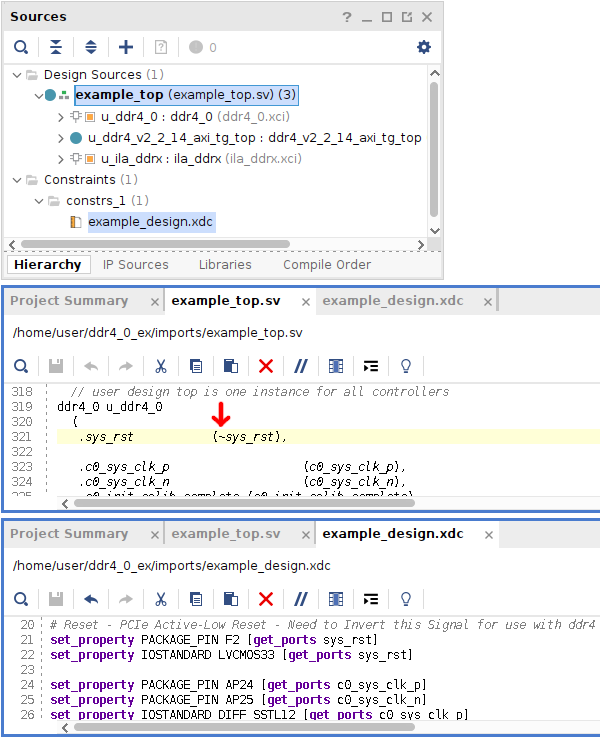

Click *Generate Bitstream* and wait for your design to build which takes about 40 minutes.

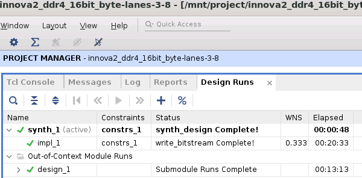

