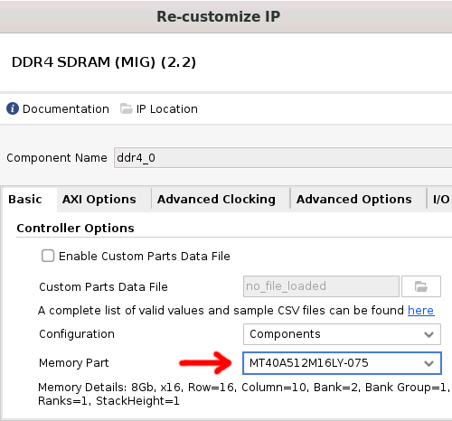
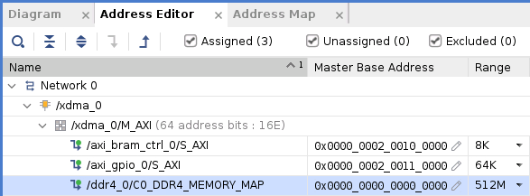
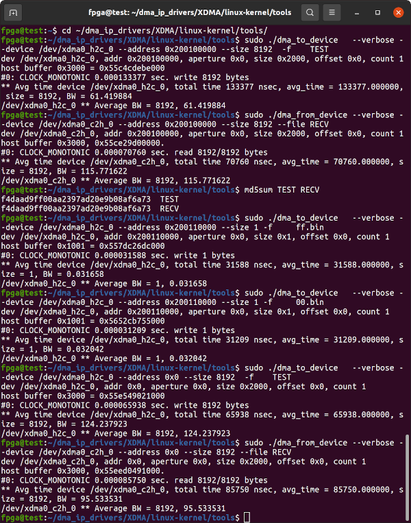
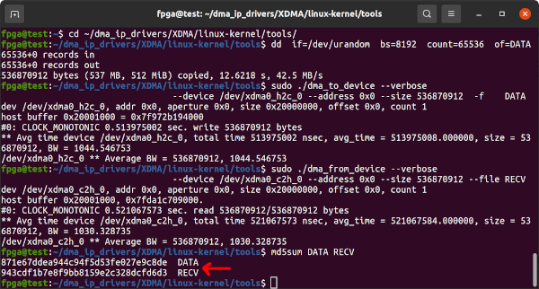
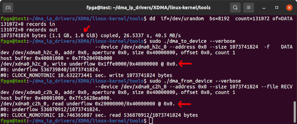

# Innova-2 MNV303212A-ADIT and MNV303212A-ADAT Test

The MNV303212A-AD**I**T and MNV303212A-AD**A**T are [4GB obsolete versions of the Innova-2](https://network.nvidia.com/pdf/eol/LCR-000437.pdf). I do not have access to these boards. [Refer to this issue](https://github.com/mwrnd/innova2_flex_xcku15p_notes/issues/3).

I have seen an MNV303212A-AD**I**T variant for sale on eBay. These boards have **MT40A512M16** DDR4 ICs with **D9TBK** [FBGA Code](https://www.micron.com/support/tools-and-utilities/fbga?fbga=D9TBK#pnlFBGA) for **4GB** of DDR4. Using these 4GB variant boards may be as simple as synthesizing and implementing Innova-2 projects with the **MT40A512M16LY-075** as the DDR4 *Memory Part*. This directory contains the [innova2_xcku15p_ddr4_bram_gpio](https://github.com/mwrnd/innova2_xcku15p_ddr4_bram_gpio) project recompiled for the **MT40A512M16LY-075** with only one active DDR4 8-bit byte lane.


Refer to the `innova2_flex_xcku15p_notes` project's instructions on [Loading a User Image](https://github.com/mwrnd/innova2_flex_xcku15p_notes/#loading-a-user-image) and load the included bitstream onto the Innova-2's FPGA Configuration Memory.

```
unzip innova2_ddr4_8bit_byte-lane-0_ADIT_MT40A512_bitstream.zip
echo a99d06c973d7bf5a7626bd56b664a193 should be MD5 Checksum of innova2_ddr4_8bit_byte-lane-0_ADIT_MT40A512_primary.bin
echo 0e688584b30f436bc48d296e00af3691 should be MD5 Checksum of innova2_ddr4_8bit_byte-lane-0_ADIT_MT40A512_secondary.bin
```

The *Memory Part* was changed to **MT40A512M16LY-075** in the DDR4 MIG Customization menus.



The size of addressable memory then had to be changed in the Address Editor.



I recompiled the *innova2_xcku15p_ddr4_bram_gpio* project for these DDR4 ICs, loaded the bitstream, and [ran through the standard tests](https://github.com/mwrnd/innova2_xcku15p_ddr4_bram_gpio#axi-bram-communication) on my 8GB Innova-2.



The tests fail! The sent and received data do not match. The design is targeting different ICs so this makes sense.



I ran a sanity check and tried sending 1GB of data. Only 512MB transfers as expected.



If you have one of these boards please [refer to this issue](https://github.com/mwrnd/innova2_flex_xcku15p_notes/issues/3).

